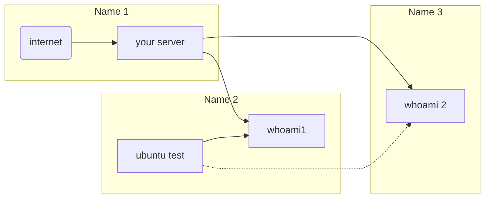

Markdown is more complex than you think, is not only about headings and tables, you can also make complex graphs and even network representations (I'm not joking with this). Today I will share with you, fellow developer, my own beginner guide for Markdown.

`````
# Heading H1

## Heading H2

### Heading H3

#### Heading H4 

##### Heading H5

###### Heading H6

This is normal text

**This is bold text**

_This is italic text_

*This is also italic text*

- This
- is
- an 
- unordened
- list    

1. This
2. is
3. a
4. list
1. Ordered 
   1. If you use
   2. Tab
      1. It is possible
      2. to use
      3. subsections
         1. really cool
         
[This text has a link to www.google.com](www.google.com)

[This text displays an image if you click on it](./path/to/image/example.jpg)


>"This text is a quote"
>
>-Jonathan  

~~Text through~~

Table:

| Name | Content | Price |
|------|---------|-------|
| Name | Content | Price |
| Name | Content | Price |
|------|---------|-------|
|------|---------|-------|
|------|---------|-------|
| Name | Content | Price |
| Name | Content | Price |
| Name | Content | Price |
| Name | Content | Price |
| Name | Content | Price |
|------|---------|-------|
|------|---------|-------|

To put some code, use inline code, like `print("Hello, you beaty thing")`

But the best practices is to use code snippets, indicating the lenguage:

````java
int b = a + c;
systemprintoutln(b);  
````
`````

Let's end this with some tricky stuff.

Take a look into [Mermaid](https://mermaid-js.github.io/mermaid/#/). It allows us to make diagrams and visualizations.

````

````


This is the final graph. Compare the code snippet with the graph to know how to create this diagram.

I recommend you to check mermaid and make more complex diagrams if you work with networks in a daily basis, because it is truly useful for this purpose. 

Thanks for reading my quick guide of Markdown. It is short, but the best things in life are short, and I hate to spend 20 minutes reading the filling of some random article from a guide in the internet about how markdown help some developer to cope with the dead of his lost cousin. Guides should get straight to the point :)