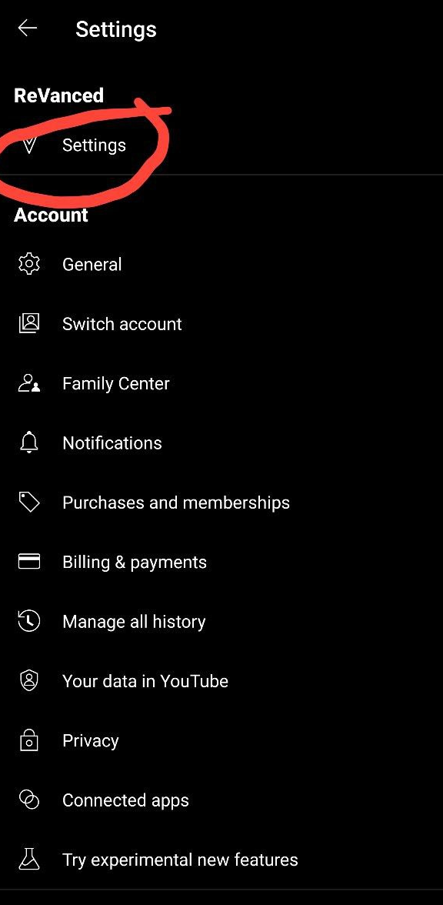
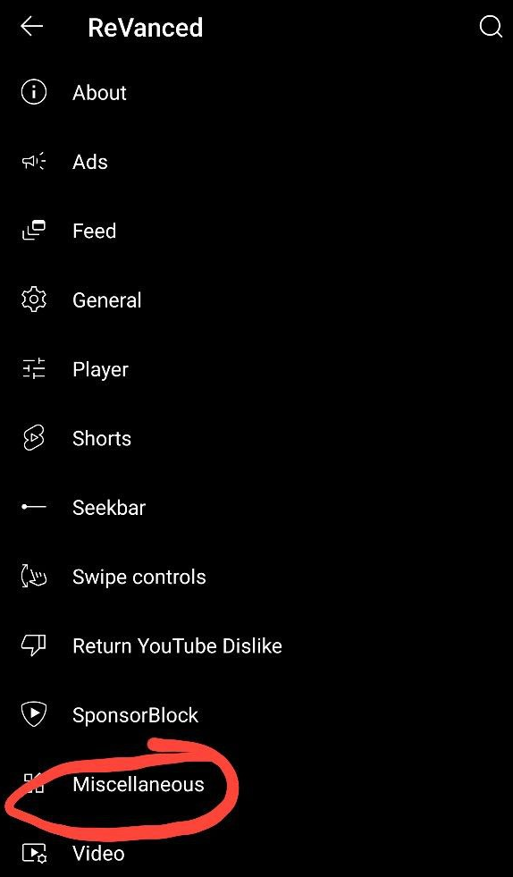
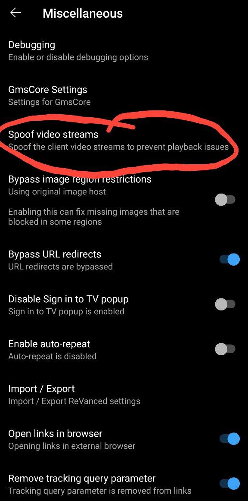
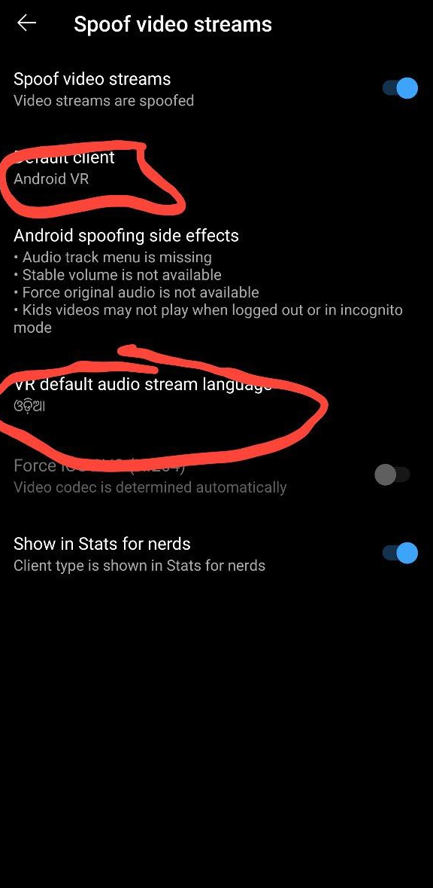

First, enter Revanced Settings:

Now, tap in the Miscellaneous menu:

Tap in the Spoof Video Streams menu:

Now set the client to be Android VR and the language for the android VR to be some random language like the one in the capture:
