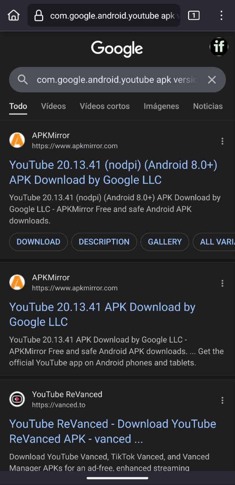
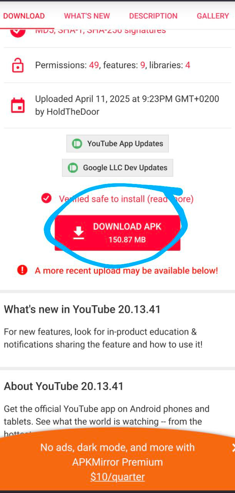
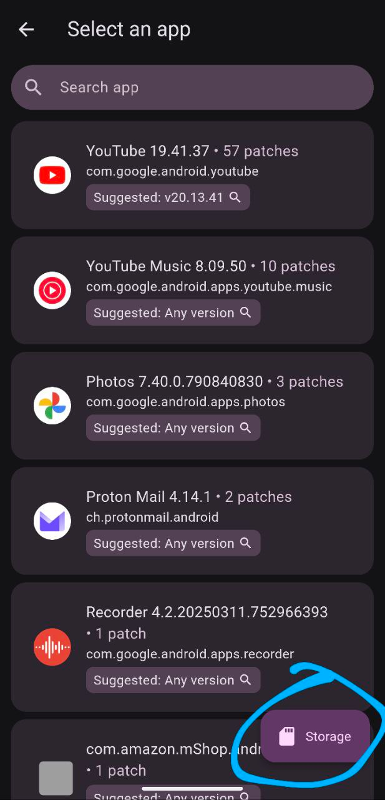
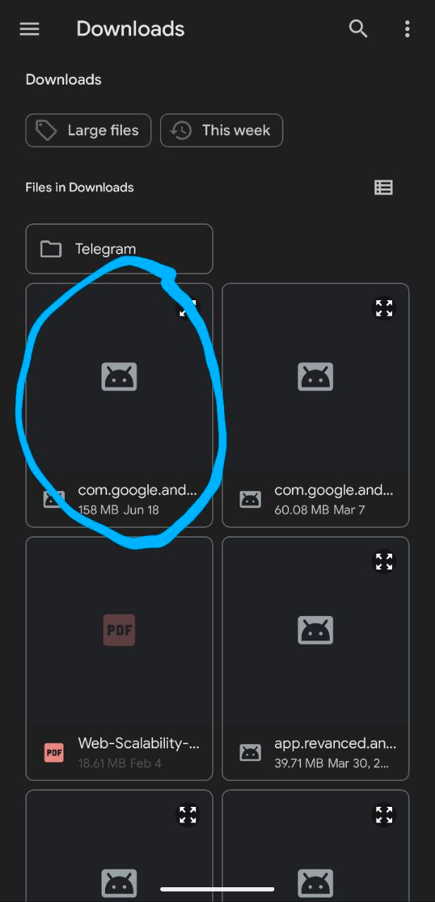

You can find the official guide here: [https://github.com/revanced/revanced-manager/tree/main/docs](https://github.com/revanced/revanced-manager/tree/main/docs)

Please, if you already had installed Youtube Revanced, or Youtube Music Revanced, uninstall it.

Now, we have to download and install the Revanced Manager APK, to patch the youtube app APK with the features we want to add. You can find the latest APK here: [https://github.com/revanced/revanced-manager/releases](https://github.com/ReVanced/revanced-manager/releases)

Download the selected file. Pick the latest one, the one at the top of the page which does not have the "dev" tag!

Now you have to download (JUST DOWNLOAD, NOT INSTALL) the latest recommended Youtube APK for patching. This step is crucial because, from time to time, youtube Revanced stops working for your Youtube Version, so you have to download the latest recommended Youtube APK version again to patch it. Your can find the latest recommended Youtube APK in the Youtube Revanced Manager application.

Enter the first google link:

Download the apk using the big red button:

Next, select the "patch" option in youtube revanced, then select the Storage button:

Then we select the APK we just downloaded. It should be named something starting with "com.google":

Now, we have to select which patches we want to include in our custom Youtube App. I have a preferred pack, but it depends of your use preferences.

You can just go with the preselected options.

Once it's done, tap install

You may get a warning saying the app install has been blocked by Play Protect.  
This is normal because the app is not from the Play Store.  
You can safely ignore the prompt and tap "More details" and then "Install anyway" to complete the install.

If this didn't work and the bottom right now says "Open", tap the 3 dots at the top right of your screen, then select "Export APK".  
Save it somewhere like your downloads folder.  
Then open your file browser app of choice, find the exported file and install it.  
It should be called something like _"youtube-revanced-versionnumber.apk"_.  
Now open YouTube ReVanced and log into your YouTube account.  

**Manager updates** 

Inside Revanced Manager will appear a blue "update manager" button when an update is available.

Tapping this will download the update and prompt you to install it.

Congratulations, you have installed Youtube Revanced without any problem. Now, it's time to enjoy your personalized youtube without ads and with a more personal approach.